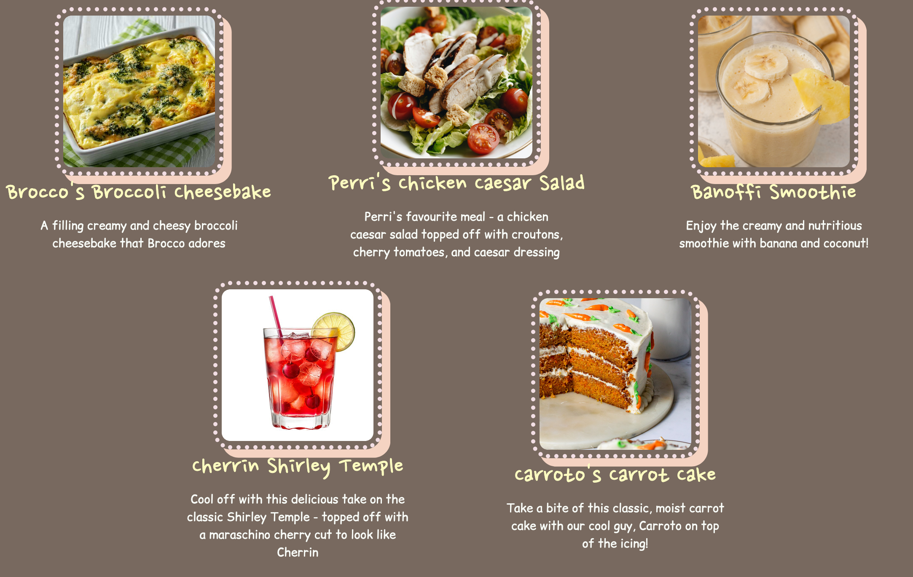
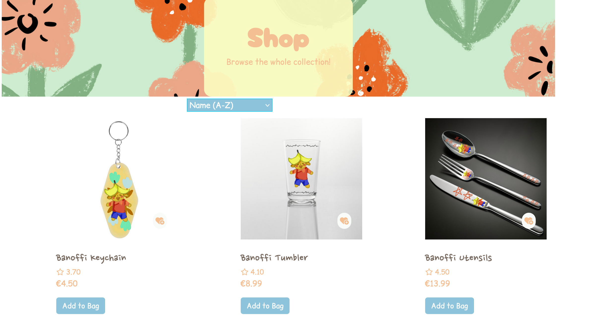
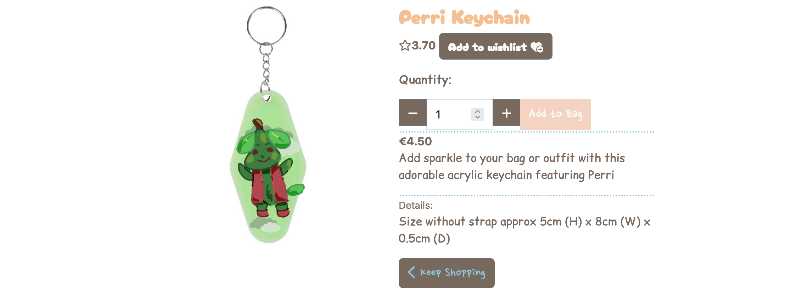
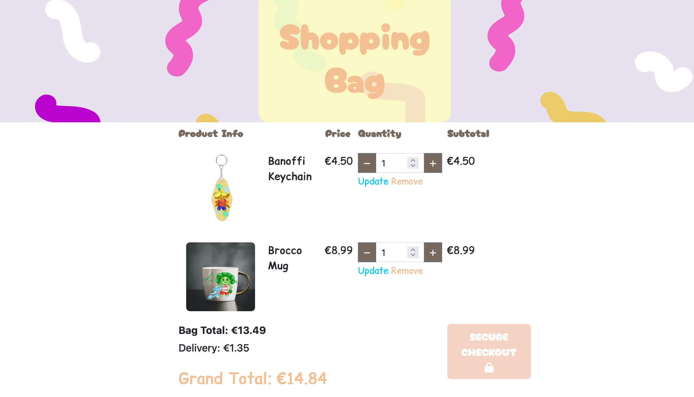

# Characafe


[Vist the live website.](https://characafe-1eb4a9dff267.herokuapp.com/)

Characafe is a cafe with a menu based on five cute characters, as well as a variety of goods dedicated to these characters. 

## Table of Contents
- [Features](#features)
- [UX Design](#ux-design)
  - [Wireframes](#wireframes)
  - [User Stories](#user-stories)
- [Deployment](#deployment)
- [Code Validation](#code-validation)
- [Testing](#testing)
- [Credits](#credits)


## Features 

### Home Page 


The front page displays a carousel of the five characters, allowing the visitor to get an understanding of them, and some of the dishes on the menu.


There are three sections to the front page - 


A carousel showing the characters that are the feature of the website. 


The menu with menu items. 


This shows the location, the opening hours and a character encouraging people to visit. 

### Navbar

The navigation bar changes depending on whether a user is logged in or not. 

When logged out, the visitor/user shall see the home page, the option to login or sign up to use the website. 


When logged in, the user will see their username and avatar with a drop down for their profile, wishlist and logout page. 


Both versions will show the cart and the number of the items that are currently in the user's cart at any given time. 


### Characters Page 


This is the page displaying the five characters so users can learn more about them, their likes, dislikes, birthday etc. There is also a button to see goods of these characters so users can buy them. 

### Menu Page 



This page allows a user to look at what is currently on the menu. 

### Products page 



This page allows a visitor or a user to view all the products, as well as sort products by character. Prices are listed and users, if in a rush, can buy a product on this page by pressing the button or click on the product name or image to find out more information.

### Product Detail Page 



This shows the product in detail, the description, technical details, being able to add a review, and also any related images for the user to browse. 

### Shopping Bag Page 



This shows the shopping bag page for the amount of items the user has in the bag, allowing the user to change quantity of the iterms or to checkout securely. 


## UX Design

### Colour Scheme 


The colour scheme for Characafe was derived from a poster of a Sanrio character, as I wanted the colour scheme to be cute but still good for accessibility purposes, with a variety of colours. 

### Typography 

Characafe uses three main fonts; these fonts were selected on being cute and giving a vibe of a cute, cosy cafe. For the navigation menu, some of the buttons and headers, Cherry Bomb One was used.
For some of the buttons, text and features, was used. Comic Relief was used for most of the body text. 

### Wireframes 

_Home Page_ 

* [main page desktop](https://wireframe.cc/0iwC3p)
* [main page tablet](https://wireframe.cc/Bf2JI6)
* [main page mobile](https://wireframe.cc/SiHKW5)

_Products Page_

* [products page desktop](https://wireframe.cc/EI3Cje)
* [products page tablet](https://wireframe.cc/jMg7bh)
* [products page mobile](https://wireframe.cc/VyUqu9)

_Characters Page_

* [characters page desktop](https://wireframe.cc/7UdzCk)
* [characters page tablet](https://wireframe.cc/IuJedb)
* [characters page mobile]( https://wireframe.cc/41b8Rr)

_Menu Page_

* [menu page desktop](https://wireframe.cc/LqSGhy)
* [menu page tablet](https://wireframe.cc/rBWUCs)
* [menu page mobile](https://wireframe.cc/2VecRq)

_Profile Page_ 

* [profile desktop](https://wireframe.cc/JUiQjQ)
* [profile tablet](https://wireframe.cc/UuHNNo) 
* [profile mobile](https://wireframe.cc/i1CxmV)

_Checkout Page_

* [checkout desktop](https://wireframe.cc/c0GPGA)
* [checkout tablet](https://wireframe.cc/xAB8cM)
* [checkout mobile](https://wireframe.cc/4zNVlf)

### Data Schema 


[Lucidchart](https://www.lucidchart.com/pages) was for the data schema for Characafe which uses a relational model, as illustrated in the Entity Relationship Diagram (ERD) provided. Above is an Entity Relationship Diagram that shows the key models and their fields.


### User Stories

| As a shopper I can view products so that I can select a product to buy                                                   | Must    |
|--------------------------------------------------------------------------------------------------------------------------|---------|
| As a shopper I can view specific details of the product, including the description, details, price                       | Must    |
| As a shopper I can see my cart and no. of products on all pages so that avoid adding too much                            | Must    |
| As a site owner, I want shoppers to have the ability to add to bag even when on the main products page for easy shopping | Must    |
| As a shopper, I would like to get a notification from the site when I add products, remove product, update the quantity  | Should  |
| As a user, I would like to create a wishlist so I favourite products I'd like to buy in the future                       | Should  |
| As a user, I'd like to see what goods are added to the wishlist                                                          | Should  |
| As a shopper I'd like to see similar products to the product I am looking at                                             | Should  |
| As a shopper I would like to be able to check out using a secure method for payment                                      | Must    |
| As a visitor, I would like to see a list of all the characters                                                           | Must    |
| As a visitor to the site, I would like to see what goods are associated with the characters                              | Should  |
| as a visitor I'd like to add reviews to a product and see reviews                                                        | Should  |
| As a user, I would like to see my previous order history                                                                 | Should  |

### Agile Development 

This project was managed and developed by using the Project Board and Issues section on GitHub - visit the project board [here.](https://github.com/users/acmuckian/projects/5). The user stories focus on the MoSCoW method as well to help prioritisation. 

## Deployment 

The live deployed application can be found on [Heroku](https://characafe-1eb4a9dff267.herokuapp.com/).

### 

### Forking 

To fork this repository, follow the below steps:

1. Login to Github.
2. Go to the repository for this project.
3. Click on the grey "fork" button on the repository main page. 
4. This should give you a forked copy in your GitHub account.


### Making a Clone 


The repository can also be cloned for local deployment. To clone the repository:

1. Login to Github.
2. Go to the repository for this project.
3. Click on the green "Code" button on the repository main page and copy the link shown.
4. Open the terminal in the code editor. 
5. Clone the repository.

### Local Deployment 

1. Clone responsitory as detailed above. 

### Heroku Deployment 

1. Log in or create a Heroku account. 
2. On the dashboard, click on the "new" button and then "create new app".
3. Give the app a name which is unique, and select the location for Common Runtime. I selected **Europe** where I am based. 
4. Click create app. 
5. After this, in the Config Vars, click reveal and insert the following variables:

| Key                   | Value                        |
|-----------------------|------------------------------|
| DATABASE_URL          | user's own value             |
| DISABLE_COLLECTSTATIC | _1 (mainly used only during initial setup)_ |
| CLOUDINARY_URL        | user's own value             |
| SECRET_KEY            | user's own value             |
| STRIPE_PUBLIC_KEY     | user's own value             |
| STRIPE_SECRET_KEY     | user's own value              |
| STRIPE_WH_SECRET      | user's own value              |

6. Ensure procfile is in the repository as required by Heroku - install with 
`echo web: gunicorn app_name.wsgi > Procfile`

(instead of app_name, put in your own app's name)
7. install dependencies using 
`pip install -r requirements.txt`
8. Select Automatic Deployment from the Heroku app to connect to your repository - alternatively, you can deploy manually via Heroku CLI or GitHub integration. 
9. Manual deployment can be done as follows:
- log in to Heroku from the terminal 
` heroku login -i `
- set the heroku remote (replace app_name with name of your heroku app) 
` heroku git:remote -a app_name `
- add, commit and push changes to github 
``` git add . git commit -m 'commit message'  git push heroku main ```
- deploy to heroku by pushing the code: 
`git push heroku main`


## Testing 

Please refer to the [testing page](TESTING.md) for information about testing and bugs. 

## Credits 

- [Very Academy](https://www.youtube.com/@veryacademy)'s youtube tutorial _Learn Django 3_ has been useful for features like the user profile, and creating a favourites feature.
- [Django](https://www.djangoproject.com/)'s official documentation was also very helpful. 
- [Stack Overflow](https://stackoverflow.com/questions) and Copilot GPT-5 in the Visual Studio Code Desktop were both useful for debugging errors. 
- [Code Institute](https://codeinstitute.net/)'s tutorial on setting up an e-commerce site using Django was extremely helpful and the basis of my project. 
- For the basis of this website, sites like [Pokemon Cafe](https://www.pokemon-cafe.jp/) was influential in determining the style and aesthetic. 
- [Unsplash](https://unsplash.com/) was used to source some of the images. 

## Technologies Used
- Django, Python, PostgreSQL, Stripe, Cloudinary, Bootstrap

## Accessibility
- Semantic HTML, alt text for images (pending completion), color contrast checked.

## Future Enhancements
- Being able to book reservations for the cafe on the website 
- Product review by star ratings for users 

