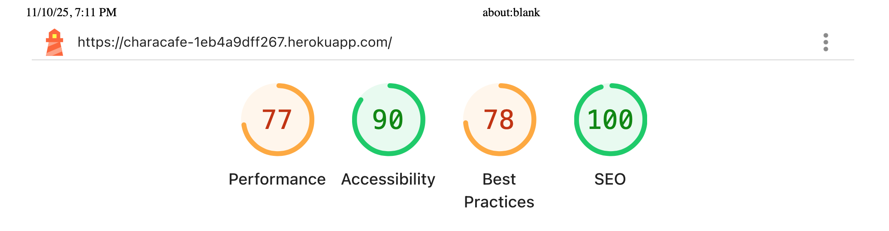
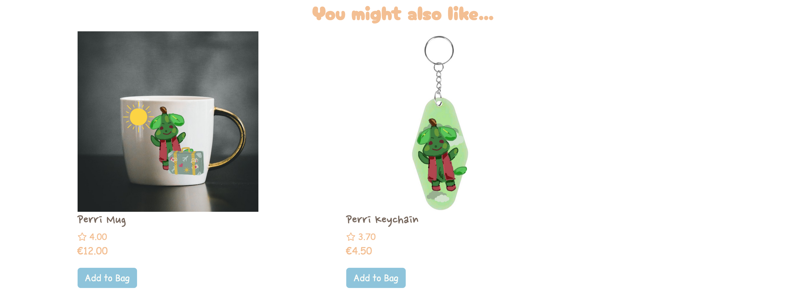
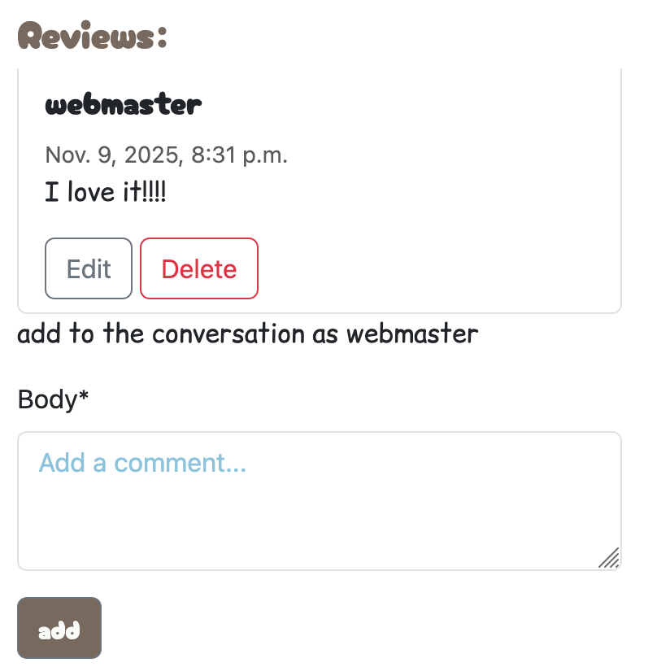
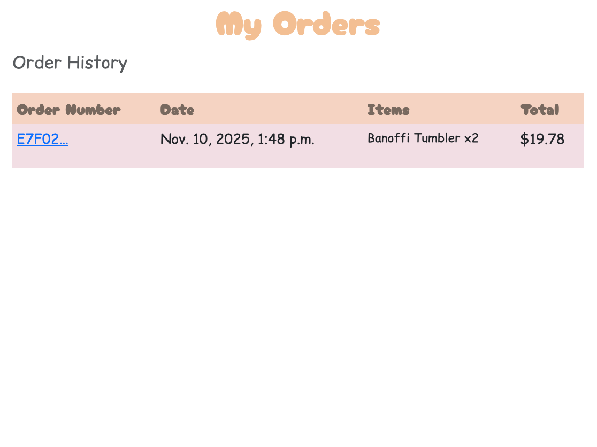

## Table of Contents
- [Performance](#performance)

- [Browser Compatibility](#browser-compatibility)
- [Responsiveness](#responsiveness)

- [Code Validation](#code-validation)

- [Testing](#testing)
  - [Automated Testing](#automated-testing)
   - [Manual Testing](#manual-testing)
  - [Features Testing](#features-testing)

## Test Environment
- Django 5.2.7, Python 3.12
- DB: Postgres (Heroku)
- Media: Cloudinary
- Static: WhiteNoise
- Email: SMTP (Gmail) in production; console backend in development
- Stripe: Test mode with webhooks

## Performance

### Google Lighthouse Performance

[Google Lighthouse](https://developers.google.com/web/tools/lighthouse) was used to test the performance of the website.

The main limitation was file sizes - particularly since this is an e-commerce website since users could in the future can upload files which are quite large. In future, attempts will be made to limit 

## Browser Compatibility

| Browser | Responsive |
|---------|------------|
| Chrome  | Yes        |
| Mozilla |    Yes       |
| Safari  |  Yes         |

## Responsiveness 

The website was tested across different browsers. It was also tested on a MacBook Pro version 12.7.6 and an iPhone 8. 

The website was tested on different mobiles and tablets, including by using Google's DevTools:

* Galaxy Note 20 Android 11
* iPad iPad OS 14.7.1 
* iPhone 11 Pro iOS 14.6

## Code Validation 

### HTML 

[HTML W3C Validator](https://validator.w3.org/nu/) was used to validate the HTML files. 

* [Home Page](https://validator.w3.org/nu/?doc=https%3A%2F%2Fcharacafe-1eb4a9dff267.herokuapp.com%2F) - no errors/warnings found 
* [Menu Page](https://validator.w3.org/nu/?doc=https%3A%2F%2Fcharacafe-1eb4a9dff267.herokuapp.com%2Fmenu) - no errors found
* [Products Page](https://validator.w3.org/nu/?doc=https%3A%2F%2Fcharacafe-1eb4a9dff267.herokuapp.com%2Fproducts) - no errors found
* [Product Detail Page](https://validator.w3.org/nu/?doc=https%3A%2F%2Fcharacafe-1eb4a9dff267.herokuapp.com%2Fproducts%2Fbrocco-mug%2F) - no errors/warnings found, one warning 
* [Wishlist Page](https://validator.w3.org/nu/?doc=https%3A%2F%2Fcharacafe-1eb4a9dff267.herokuapp.com%2Fproducts%2Fwishlist%2F) - no errors, one info on an input tag 
* [Checkout Page](https://validator.w3.org/nu/?doc=https%3A%2F%2Fcharacafe-1eb4a9dff267.herokuapp.com%2Fcheckout) - no errors found
* [Profile Page](https://validator.w3.org/nu/?doc=https%3A%2F%2Fcharacafe-1eb4a9dff267.herokuapp.com%2Fprofiles%2F) - one info on input tag, no errors 
* [Contact Page](https://validator.w3.org/nu/?doc=https%3A%2F%2Fcharacafe-1eb4a9dff267.herokuapp.com%2Fcontact%2F) - errors related to crispy forms formulation and it couldn't be avoided with time constraints 
* [Login Page](https://validator.w3.org/nu/?doc=https%3A%2F%2Fcharacafe-1eb4a9dff267.herokuapp.com%2Faccounts%2Flogin%2F) - no errors found 
* [Sign Up Page](https://validator.w3.org/nu/?doc=https%3A%2F%2Fcharacafe-1eb4a9dff267.herokuapp.com%2Faccounts%2Fsignup) - some errors were related to the allauth and to avoid disrupting functionality, it was left as-is
* [Logout Page](https://validator.w3.org/nu/?doc=https%3A%2F%2Fcharacafe-1eb4a9dff267.herokuapp.com%2Faccounts%2Flogout) - no errors found 

### Javascript 

[JSHint](https://jshint.com/) was used to check the validity of the javascript on stripe_elements.js - one note that stripe was not a defined variable. 

No errors on the javascript in the product_detail or products pages. 

### CSS 

[Jigsaw CSS](https://jigsaw.w3.org/css-validator/) was used to validate the CSS via a direct upload of the styles.css file. There were no errors and 42 warnings. 

### Python 

[PEP8 CI Python Linter](https://pep8ci.herokuapp.com/#) was used to validate the Python code by PEP8 standards.

**Checkout**

- _admin.py_ - no errors found
- _forms.py_ - no errors found
- _models.py - no errors found 
- _signals.py_ - no errors found 
- _views.py_ - no errors found

**Products** 

- _admin.py_ - no errors found
- _forms.py_ - no errors found 
- _models.py_ - no errors found
- _views.py_ - no errors found 

**Bag**

- _views.py - no errors found

**Home**

- _models.py_ - no errors found 
- _views.py_ - no errors found 

**Contact** 

- _forms.py_ - no errors found
- _models.py_ - no errors found 
- _views.py_ - no errors found 
## Testing 

### Automated Testing 

Automated testing was not completed for this project. 

## Manual Testing

### User Stories Testing 

| As a shopper I can view products so that I can select a product to buy                                                   |               |
|--------------------------------------------------------------------------------------------------------------------------|--------------------------------------------------------------|
| As a shopper I can view specific details of the product, including the description, details, price                       |      |
| As a shopper I can see my cart and no. of products on all pages so that avoid adding too much                            |               |
| As a site owner, I want shoppers to have the ability to add to bag even when on the main products page for easy shopping |               |
| As a shopper, I would like to get a notification from the site when I add products, remove product, update the quantity  |                  |
| As a user, I would like to create a wishlist so I favourite products I'd like to buy in the future                       | Yes                                                          |
| As a user, I'd like to see what goods are added to the wishlist                                                          | Yes                                                          |
| As a shopper I'd like to see similar products to the product I am looking at                                             |        |
| As a shopper I would like to be able to check out using a secure method for payment                                      | Yes                                                          |
| As a visitor, I would like to see a list of all the characters                                                           |  |
| As a visitor to the site, I would like to see what goods are associated with the characters                              |  |
| as a visitor I'd like to add reviews to a product and see reviews                                                        |                         |
| As a user, I would like to see my previous order history                                                                 |                    |
| As a user, I'd like to see where the cafe is located and its opening hours                                               |    |

## Features Testing 
|                         **Home   Page**                         |            |
|:---------------------------------------------------------------:|:----------:|
| **Feature**                                                     | **Status** |
| Clicking   Characafe brings up home page                        | Yes        |
| clicking   contact leads to contact page                        | Yes        |
| clicking   menu leads to menu page                              | Yes        |
| clicking   menu leads to characters page                        | Yes        |
| navbar   shows username when logged in                          | Yes        |
| dropdown   beside avatar shows profile, wishlist and logout     | Yes        |
| click   logout goes to logout page                              | Yes        |
| clicking   profile goes to profile page                         | Yes        |
| clicking   shopping bag icon shows bag page                     | Yes        |
| **carousel  **                                                  |            |
| clicking   right on the carousel shows next slide               | Yes        |
| clicking   right on the carousel shows slide before             | Yes        |
| carousel   moves independently                                  | Yes        |
| **menu  **                                                      |            |
| menu   icons spin when hovered over                             | Yes        |
| **footer**                                                      |            |
| clicking   social media icons open social media page in new tab | Yes        |
| can't   subscribe unless you enter text                         | Yes        |
| can't   subscribe without entering an email address             | Yes        |

| **Shop   Main Page**                                                            |            |
|---------------------------------------------------------------------------------|------------|
| **Feature**                                                                     | **Status** |
| Adding   product to wishlist notifies you it was added                          | Yes        |
| adding   product to bag updates the bag                                         | Yes        |
| adding   product to bag notifies that it was added                              | Yes        |
| adding   product to bag notification shows you a summary of what is in the bag  | Yes        |
| clicking   on product image brings you to product page                          | Yes        |
| clicking   on product title brings you to product page                          | Yes        |
| sorting   price low to high shows lowest priced item first                      | Yes        |
| sorting   name Z-A shows name order Z-A                                         | Yes        |
| sorting   name A-Z shows name order A-Z                                         | Yes        |
| sorting   rating high to low shows product with highest ratings first           | Yes        |

| **Contact   Page**                                                                                          |            |
|-------------------------------------------------------------------------------------------------------------|------------|
| **Feature**                                                                                                 | **Status** |
| inserting   text but not an email address on the contact page prompts for an email   address to be inserted | Yes        |
| contact   submit shows contact modal                                                                        | Yes        |
| cannot   subscribe without inserting email                                                                  | Yes        |
| must be   an email address for subscription                                                                 | Yes        |
| clicking   submit triggers a modal notification for the subscription                                        | Yes        |
| clicking   submit triggers a modal notification for the message being sent                                  | Yes        |

| **Products   Detail Page**                                              |            |
|--------------------------------------------------------------------------|------------|
| **Feature**                                                              | **Status** |
| Cannot add quantity below 0                                              | Yes        |
| Clicking   keep shopping returns to shop main page                       | Yes        |
| Clicking add to bag adds item to bag                                     | Yes        |
| Clicking add to bag shows toast                                          | Yes        |
| "You   might also like" shows items with that character in it            | Yes        |
| A visitor can add a comment                                              | Yes        |
| A   visitor can edit or delete their comment                             | Yes        |
| Clicking   on a related product image brings user to product's home page | Yes        |
| Unable   to add to bag for unavailable products                          | Yes        |
| Adding   to wishlist notifies you it was added to wishlist               | Yes        |

| **Checkout   Page**                                                                                              |            |
|------------------------------------------------------------------------------------------------------------------|------------|
| **Feature**                                                                                                      | **Status** |
| cannot   complete order without putting in name, email, phone no., street address,   town/city, county, country  | Yes        |
| cannot   complete order without card details                                                                     | Yes        |
| cannot   put in an invalid card number                                                                           | Yes        |
| told   correct amount charged                                                                                    | Yes        |
| side   column shows my orders, the product, name, quantity, sub-total and the total                              | Yes        |
| successful   details completion triggers loading overlay and checkout success page                               | Yes        |
| **Checkout   Success Page **                                                                                     |            |
| toast   shows my order no and that confirmation email sent                                                       | Yes        |
| order   shows my delivery information as I inserted it                                                           | Yes        |
| billing   info shows the amount, delivery fee, grand total                                                       | Yes        |
| clicking   rest of range button brings to product page                                                           | Yes        |

| **User   Registratiom**                                                                     |            |
|---------------------------------------------------------------------------------------------|------------|
| **Feature**                                                                                 | **Status** |
| When   registering, the user gets a page to state an email is being sent for   verification | Yes        |
| Password   cannot be too short/weak                                                         | Yes        |
| User   receives an email if valid email address given                                       | Yes        |
| Clicking   on the email link verifies the user                                              | Yes        |
| Only   logged in users can see the wishlist icons                                           | Yes        |
| Only   logged in users can see their own profile/order history                              | Yes        |
| Logging   out logs out user successfully                                                    | Yes        |

## Bugs 

| **Bugs**                                                       |                                                                                                                                                                             |
|----------------------------------------------------------------|-----------------------------------------------------------------------------------------------------------------------------------------------------------------------------|
| **Bug**                                                        | **Fix**                                                                                                                                                                     |
| Logged   out users could not see the cart                      | The  was wrapped over the cart as well, so this was moved so logged-out users   can see their cart too                                      |
| The   footer was not behaving on the log-out or register pages | The base.html wraps the block   content in a div with the .container class, so an extra .container class   disrupted the footer being pushed to the bottom                  |
| users could not verify their emails                            | The confirm_email html had been   amended and the logic removed, so there was no form POST feature to let the   site know the user verified their email - this was resolved |
| server 500 error when updating bag quantity | this was because the update bag code when quantity was above 0 (which was always) never set the session as that was under the else logic, so it was changed so the session persisted and the redirect happened in all cases |
| when a product is added to the wishlist, an s appears | on toast_info.html, a stray s was added after the div tags and was removed |